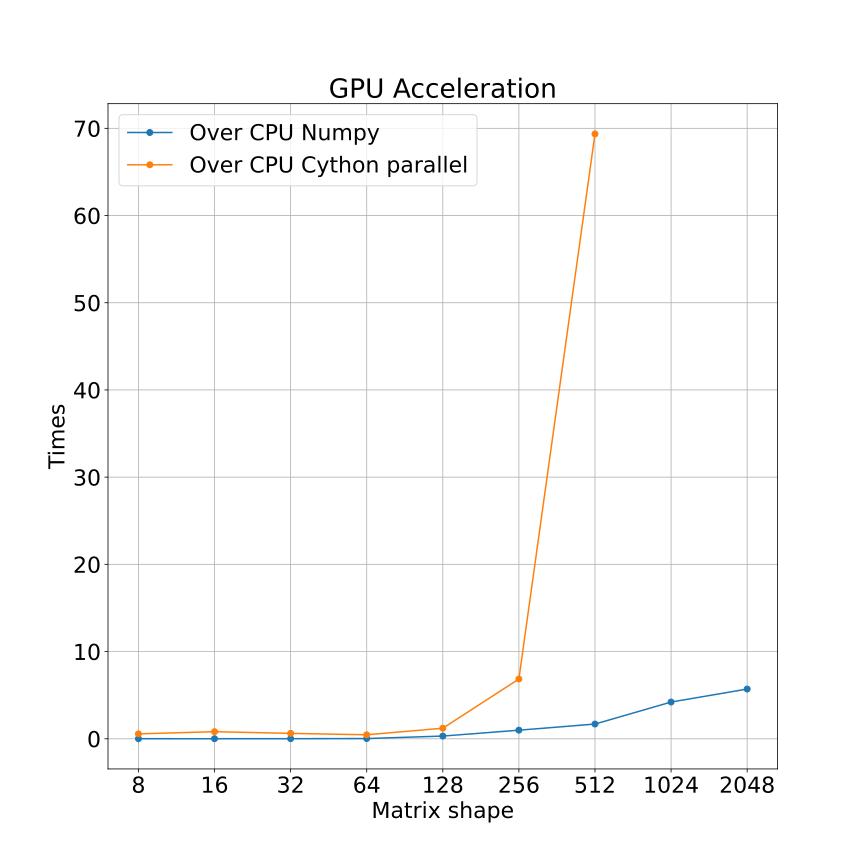

# Lab 1. Gribanov Danil - 6133
## Hardware
- NVIDIA GeForce GTX 1050Ti;
- Intel(R) i7-8750H;

## What compare

- Python (1 thread);
- Numpy dot (OpenMP);
- Cuda via Cython call (GPU);
- C++ via Cython call (1 thread);
- Cython (1 thread);
- Cython paralell (OpenMP, 6 threads);

# How to...
Build docker via
```
docker-compose up --build -d
```

Attach to docker shell and go to `/home/lab1` folder.

Inside folder run:
```
./init.sh
```

To install Python and other libraries for current work.
In the end Jupyter Notebook will start (in console will be url for it), where work can be done.

# Results

All implementations:


Without python (1 thread):


Gpu acceleration:




# Conclusion
When dealing with large matrices (shape more than 512 by one side), its better to run it on GPU (faster/efficient compare to CPU), or use OpenMP/many-threads on CPU. In smaller one, its no difference where to run it.

- Cython:
    
    \+ C in Python;
    
    \+ Can call native code in C/C++ (as in this work we call CUDA and native C++ code);
    
    \+ Cython code can be faster as native C/C++;
    
    \- Boilerplate code;
    
    \- C++/C like syntax, link libraries, code compliation and etc...
