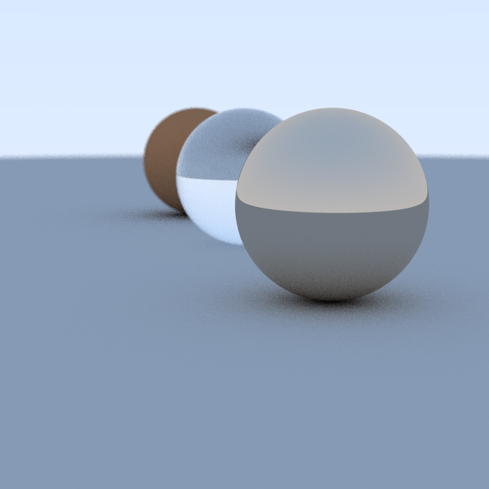
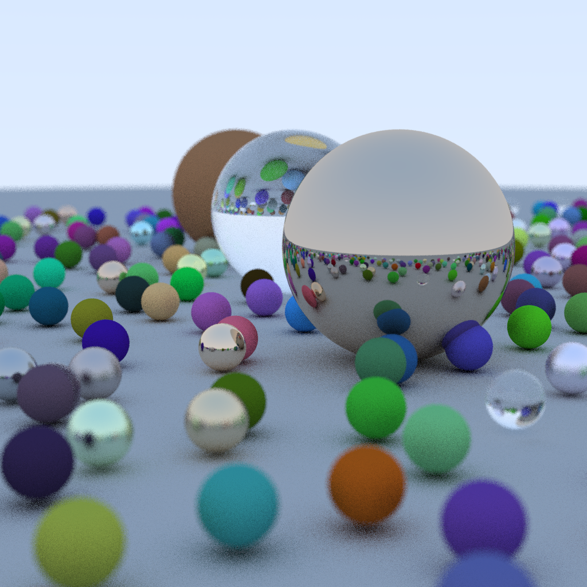
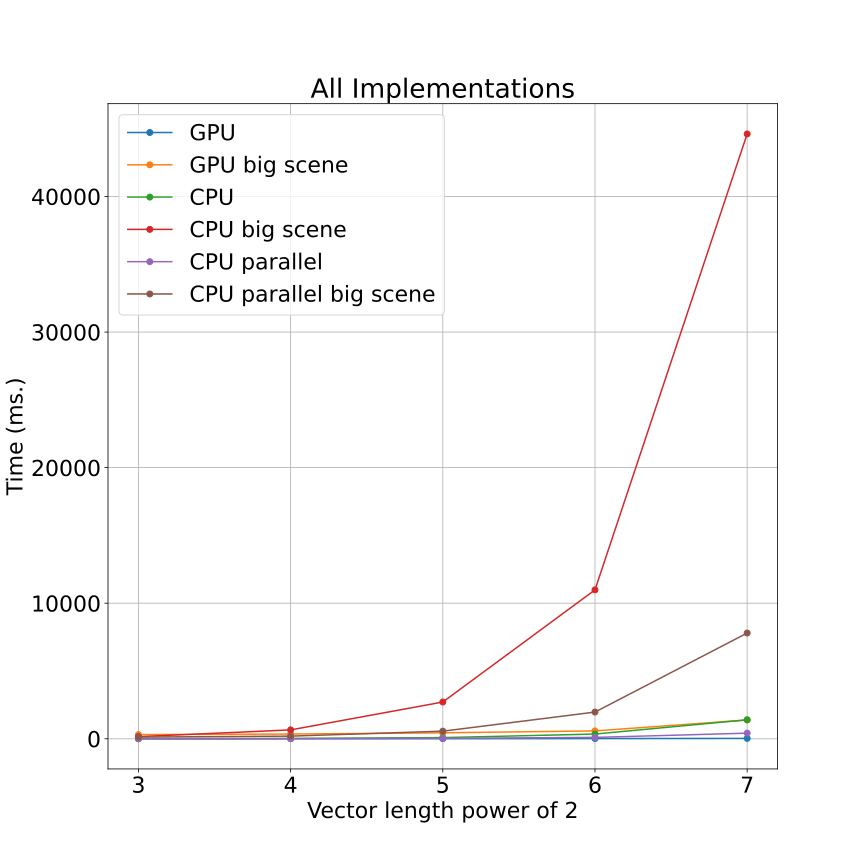
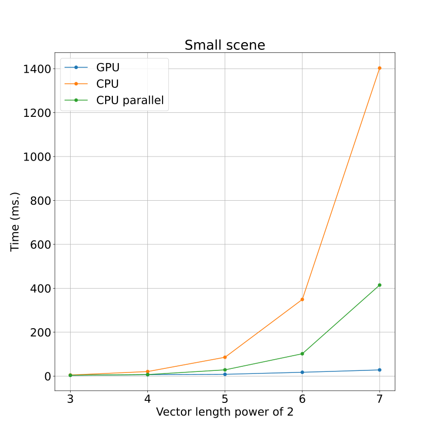
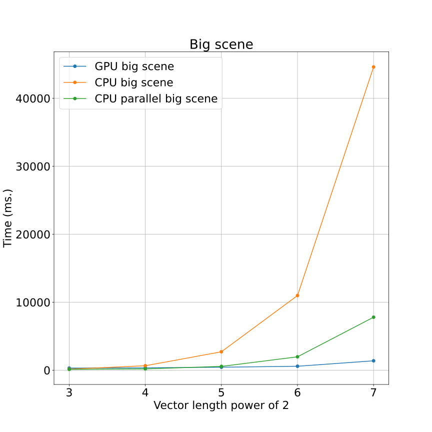
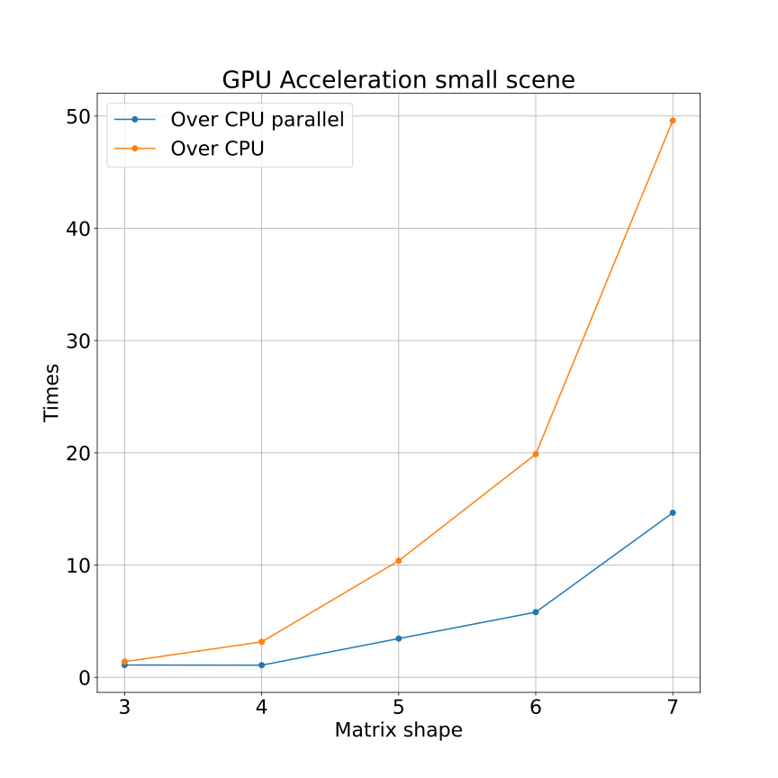
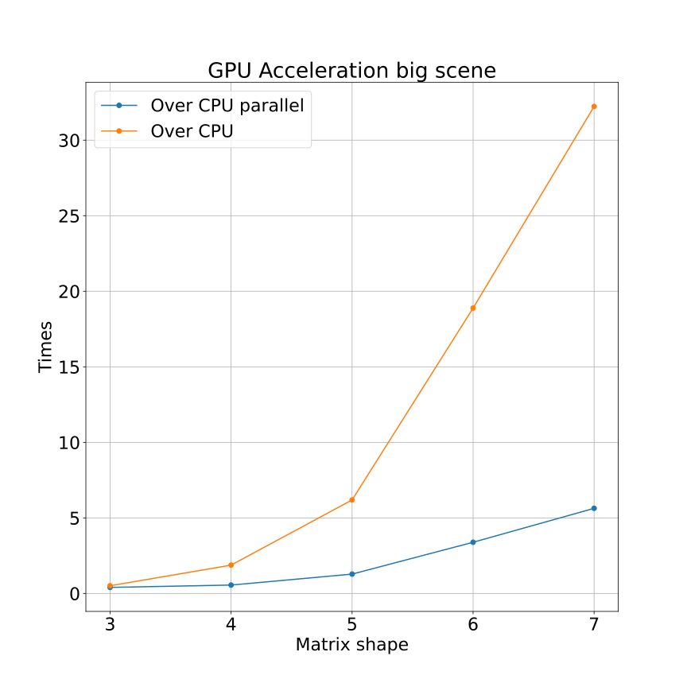

# Lab 2. Gribanov Danil - 6133. Raytracing
## Hardware
- NVIDIA GeForce GTX 1050Ti;
- Intel(R) i7-8750H;

## What compare

- C++ parallel (OpenMP) via Cython call (6 threads, CPU);
- Cuda via Cython call (GPU);
- C++ via Cython call (1 thread, CPU);

# How to...
Build docker via
```
docker-compose up --build -d
```

Attach to docker shell and go to `/home/lab2` folder.

Inside folder run:
```
./init.sh
```

To install Python and other libraries for current work.
In the end Jupyter Notebook will start (in console will be url for it), where work can be done.

# Raytracing and whats rendered here
In this repo, I compare two scene - small and big. 

Small scene consist of 3 balls with raytracing.
Example:



Big scene consist of around random 26-30 balls with raytracing. Example:



# Results

All implementations:



Render on small scene:



Render on big scene:



Gpu acceleration for small scene:




Gpu acceleration for big scene:




# Conclusion
When dealing with big scenes and images (shape more than 2^5), its better to run it on GPU using CUDA. 

In smaller one scenes and images, its still better to use CUDA/parallel-CPU.


- Cython:
    
    \+ C in Python;
    
    \+ Can call native code in C/C++ (as in this work we call CUDA and native C++ code, even OpenMP!);
    
    \+ Cython code can be faster as native C/C++;
    
    \- Boilerplate code;
    
    \- C++/C like syntax, link libraries, code compliation and etc...